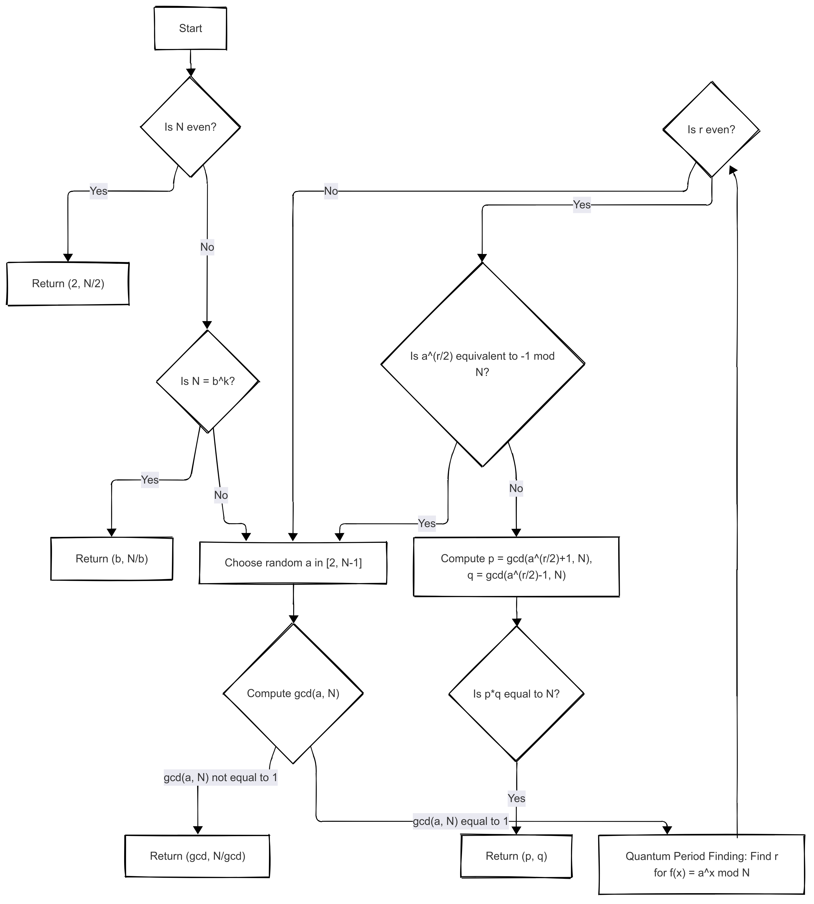

# Quantum Factorisation
     Process of factoring integers using Quantum Algorithms, most notably the Shor's Algorithm leveraging the principles of quantum mechanics to solve the integer factorisation problem exponentially faster than classical algorithms

     When it comes to factorising large numbers, the time required by any classical algorithm increases exponentially, however, quantum factorisation can do so in polynomial time complexity thereatening currect cryptographic systems like RSA

# Shor's Algorithm
    Shor's Algorithm was founded by Peter Shor in 1994 to factorise large numbers exponentially faster than classical computers. It solves the problem of factorisation and also breaks cryptographic systems like RSA

## Steps in Shor's Algorithm
- Check if N is even or has small prime numbers
- If yes return trivial factors
- Find the period r of the function f(x) = 
$$
f(x) = a^x \mod N 
$$
(where a is a random integer coprime to N) 

- Use \(r\) to compute the factors:
$$
\gcd(a^{r/2} \pm 1, N)
$$

## Pseudocode for Shor's Algorithm
```
Function Shor(N):
    if N is even:
        return (2, N/2)
    if N is a perfect power (e.g., N = b^k):
        return (b, N/b)
    while true:
        choose random a in [2, N-1]
        g = gcd(a, N)
        if g != 1:
            return (g, N/g)
        else:
            quantumly find period r of f(x) = a^x mod N
            if r is even and a^(r/2) ≠ -1 mod N:
                p = gcd(a^(r/2) + 1, N)
                q = gcd(a^(r/2) - 1, N)
                if p*q == N:
                    return (p, q)
```
---
### **Advantages**
- **Exponential Speedup**: Factors integers in O((log N)^3) time vs. O(e^(1.9 (log N)^(1/3))) for classical algorithms.
- **Breaks RSA**: Threatens RSA encryption by efficiently factoring large semiprimes.
- **Quantum Advantage**: Demonstrates quantum supremacy for practical problems.

---

### **Challenges**
1. **Qubit Requirements**:
   - Needs ~2n qubits to factor an n-bit number (e.g., 4,096 qubits for 2048-bit RSA).
2. **Noise and Errors**:
   - Current quantum hardware (NISQ devices) lacks error correction.
3. **Scalability**:
   - Modular exponentiation circuits are complex and require deep quantum circuits.

---

## Flowchart of Shor's Algorithm
