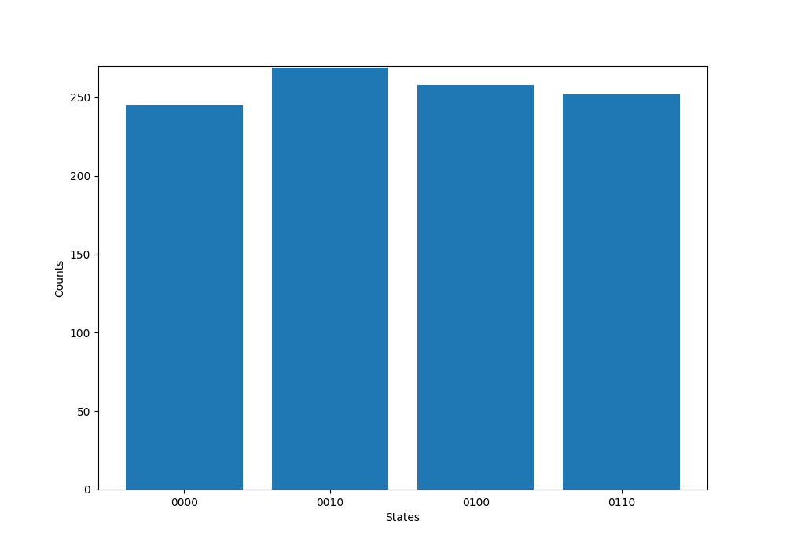
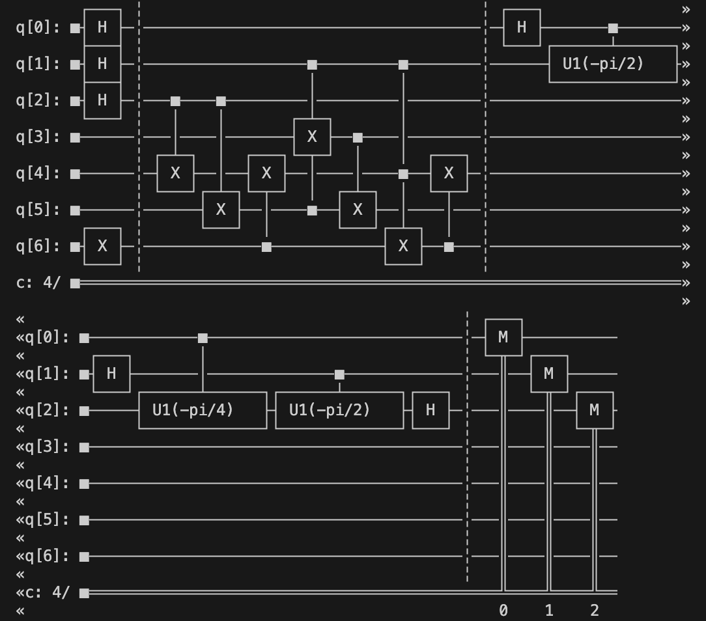

# Explanation to the file main.py

---

## 1. **Setting Up the Quantum Computer**
- The code connects to a **quantum computer** provided by a service called `QuantumRings`.
- It uses a specific quantum computer backend (a machine) named `scarlet_quantum_rings`.
- The code sets the number of times the quantum program will run (`shots = 1024`), meaning it will repeat the experiment 1024 times to get reliable results.

---

## 2. **Building the Quantum Circuit**
- A **quantum circuit** is like a program for a quantum computer. It’s made up of **quantum gates** (operations) that manipulate **qubits** (quantum bits).
- The circuit has **7 qubits** and **4 classical bits** (used to store the final results).
- The code initializes the qubits by applying some gates:
  - It puts the first 3 qubits into a **superposition** (a special quantum state where they can be 0 and 1 at the same time) using the `H` (Hadamard) gate.
  - It flips the state of the 7th qubit using the `X` gate.

---

## 3. **Performing Modular Exponentiation**
- This part of the code simulates a mathematical operation called **modular exponentiation**, which is a key step in Shor’s algorithm.
- It uses **controlled gates** (like `CX` and `CCX`) to perform calculations on the qubits. These gates are like switches that only activate when certain qubits are in a specific state.
- The goal here is to compute \(7^x \mod 15\), which is part of finding the factors of the number 15.

---

## 4. **Inverse Quantum Fourier Transform (IQFT)**
- After the calculations, the code applies something called the **Inverse Quantum Fourier Transform (IQFT)**.
- This is like decoding the results of the quantum computation into something we can measure and understand.
- The IQFT is implemented using a series of controlled rotation gates (`CU1`) and Hadamard gates (`H`).

---

## 5. **Measuring the Results**
- The code measures the first 3 qubits and stores the results in the classical bits.
- These measurements give us the output of the quantum computation.

---

## 6. **Drawing and Saving the Quantum Circuit**
- The code draws the quantum circuit as a diagram and saves it as an image file (`quantum_circuit.png`). This helps visualize the steps in the quantum program.

---

## 7. **Running the Quantum Program**
- The code sends the quantum circuit to the quantum computer and runs it.
- It waits for the results and monitors the progress of the job.

---

## 8. **Plotting and Saving the Results**
- Once the results are ready, the code counts how many times each possible outcome occurred.
- It creates a **histogram** (a bar chart) to show the frequency of each result.
- The histogram is saved as an image file (`histogram.png`).

---

## Circuit

# Explaination to file1.py
This code demonstrates how to use a **quantum computer** to factorize **semiprime numbers** (numbers that are the product of two prime numbers). It uses a simplified version of **Shor's algorithm** and saves the results in a CSV file. Here's a breakdown of what the code does:

---

## 1. **Setting Up the Quantum Computer**
- The code connects to a **quantum computer** provided by a service called `QuantumRings`.
- It uses a specific quantum computer backend (a machine) named `scarlet_quantum_rings`.
- The code sets the number of times the quantum program will run (`shots = 1024`), meaning it will repeat the experiment 1024 times to get reliable results.

---

## 2. **Defining Helper Functions**
### a. **Inverse Quantum Fourier Transform (IQFT)**
- The `iqft_cct` function implements the **Inverse Quantum Fourier Transform**, which is used to decode the results of the quantum computation.
- It uses controlled rotation gates (`CU1`) and Hadamard gates (`H`) to perform the transformation.

### b. **Plotting Histogram**
- The `plot_histogram` function creates a **histogram** (bar chart) to visualize the results of the quantum computation.
- It takes the counts of each quantum state and plots them as a bar chart.

### c. **Extracting Factors**
- The `get_factors_from_counts` function extracts the factors of a number from the measurement results.
- It uses the **greatest common divisor (GCD)** to find factors of the number being factorized.

---

## 3. **Semiprimes to Factorize**
- The code defines a dictionary called `semiprimes`, which contains a list of semiprime numbers and their corresponding number of qubits required for the computation.
- For example:
  - 8 qubits are used to factorize 143.
  - 10 qubits are used to factorize 899.
  - And so on.

---

## 4. **Running the Factorization**
- The code opens a CSV file (`factors.csv`) to save the results of the factorization.
- It iterates through each semiprime in the `semiprimes` dictionary and performs the following steps:

### a. **Create Quantum Circuit**
- For each semiprime, the code creates a quantum circuit with the required number of qubits and classical bits.
- It initializes the qubits by applying **Hadamard gates** to the first half of the qubits and an **X gate** to the last qubit.

### b. **Modular Exponentiation**
- The code performs a placeholder operation for **modular exponentiation**, which is a key step in Shor's algorithm.
- For simplicity, it uses **controlled-X gates** (`CX`) to simulate the operation.

### c. **Apply IQFT**
- The code applies the **Inverse Quantum Fourier Transform (IQFT)** to decode the results of the computation.

### d. **Measure Qubits**
- The code measures the first half of the qubits and stores the results in classical bits.

### e. **Run the Quantum Program**
- The quantum circuit is sent to the quantum computer for execution.
- The code waits for the results and monitors the progress of the job.

### f. **Extract Factors**
- The code uses the `get_factors_from_counts` function to extract factors from the measurement results.
- If exactly two factors are found, they are saved to the CSV file. Otherwise, placeholder values (1 and the number itself) are used.

---

## 5. **Saving Results**
- The results of the factorization are saved in a CSV file named `factors.csv`.
- The file contains three columns:
  1. **Semiprime**: The number being factorized.
  2. **Factor 1**: The first factor.
  3. **Factor 2**: The second factor.

---

## 6. **Output**
- After running the code, the factors of each semiprime are printed to the console and saved in the `factors.csv` file.
- For example:
  - Factors of 143 saved to `factors.csv`: 11, 13.
  - Factors of 899 saved to `factors.csv`: 29, 31.

---

# Explanation to main2.py
## 1. **Setting Up the Quantum Computer**
- The code connects to a **quantum computer** provided by a service called `QuantumRings`.
- It uses a specific quantum computer backend (a machine) named `scarlet_quantum_rings`.
- The code sets the number of times the quantum program will run (`shots = 1024`), meaning it will repeat the experiment 1024 times to get reliable results.

---

## 2. **Defining Helper Functions**
### a. **Inverse Quantum Fourier Transform (IQFT)**
- The `iqft_cct` function implements the **Inverse Quantum Fourier Transform**, which is used to decode the results of the quantum computation.
- It uses controlled rotation gates (`CU1`) and Hadamard gates (`H`) to perform the transformation.

### b. **Plotting Histogram**
- The `plot_histogram` function creates a **histogram** (bar chart) to visualize the results of the quantum computation.
- It takes the counts of each quantum state and plots them as a bar chart.

### c. **Extracting Factors**
- The `get_factors_from_counts` function extracts the factors of a number from the measurement results.
- It uses the **greatest common divisor (GCD)** to find factors of the number being factorized.

---

## 3. **Semiprimes to Factorize**
- The code defines a dictionary called `semiprimes`, which contains a list of semiprime numbers and their corresponding number of qubits required for the computation.
- For example:
  - 36 qubits are used to factorize 52734393667.
  - 38 qubits are used to factorize 171913873883.
  - And so on.

---

## 4. **Running the Factorization**
- The code opens a CSV file (`factors1.csv`) to save the results of the factorization.
- It iterates through each semiprime in the `semiprimes` dictionary and performs the following steps:

### a. **Create Quantum Circuit**
- For each semiprime, the code creates a quantum circuit with the required number of qubits and classical bits.
- It initializes the qubits by applying **Hadamard gates** to the first half of the qubits and an **X gate** to the last qubit.

### b. **Modular Exponentiation**
- The code performs a placeholder operation for **modular exponentiation**, which is a key step in Shor's algorithm.
- For simplicity, it uses **controlled-X gates** (`CX`) to simulate the operation.

### c. **Apply IQFT**
- The code applies the **Inverse Quantum Fourier Transform (IQFT)** to decode the results of the computation.

### d. **Measure Qubits**
- The code measures the first half of the qubits and stores the results in classical bits.

### e. **Run the Quantum Program**
- The quantum circuit is sent to the quantum computer for execution.
- The code waits for the results and monitors the progress of the job.

### f. **Extract Factors**
- The code uses the `get_factors_from_counts` function to extract factors from the measurement results.
- If exactly two factors are found, they are saved to the CSV file. Otherwise, placeholder values (1 and the number itself) are used.

---

## 5. **Saving Results**
- The results of the factorization are saved in a CSV file named `factors1.csv`.
- The file contains three columns:
  1. **Semiprime**: The number being factorized.
  2. **Factor 1**: The first factor.
  3. **Factor 2**: The second factor.

---

## 6. **Output**
- After running the code, the factors of each semiprime are printed to the console and saved in the `factors1.csv` file.
- For example:
  - Factors of 52734393667 saved to `factors1.csv`: [Factor 1], [Factor 2].
  - Factors of 171913873883 saved to `factors1.csv`: [Factor 1], [Factor 2].

---

# Explanation to main3.py

1. Importing Libraries
The code starts by importing various tools and libraries:

QuantumRingsLib: A library for working with quantum computers.

matplotlib, numpy, math, csv, fractions: Standard Python libraries for math, data handling, and visualization.

Think of these as toolboxes that the program needs to do its job.

2. Modular Exponentiation (mod_exp)
This function calculates a^x mod N efficiently. It's like finding the remainder when a^x is divided by N, but it does this quickly using a smart algorithm called "square-and-multiply."

3. Controlled Modular Multiplication (controlled_mod_mult)
This is a quantum operation that multiplies two numbers in a special way, controlled by a quantum bit (qubit). It uses:

Quantum gates: Like tiny switches that manipulate qubits.

Ancilla qubits: Helper qubits to store temporary results.

4. Quantum Fourier Transform (qft and iqft)
These functions perform a mathematical operation called the Quantum Fourier Transform (QFT) and its inverse. Think of QFT as a way to change the "perspective" of the qubits to reveal hidden patterns.

5. Creating the Quantum Circuit (create_quantum_circuit)
This function builds the quantum circuit, which is like a blueprint for the quantum computer to follow. It:

Sets up qubits for counting, target values, and helper tasks.

Applies quantum gates to perform calculations.

Uses the controlled modular multiplication and inverse QFT to find patterns in the numbers.

6. Processing Results (process_results)
After the quantum computer runs, it gives us a set of results. This function:

Converts the quantum results into numbers.

Uses math to find possible factors of the input number.

7. Main Program
Here’s what the main part of the program does:

Connects to a Quantum Computer:

It uses a special token to connect to a quantum computer provided by QuantumRingsProvider.

Defines the Numbers to Factor:

It has a list of large numbers (called semiprimes) that need to be factored.

Runs the Quantum Circuit:

For each number, it creates a quantum circuit and sends it to the quantum computer.

The quantum computer runs the circuit and returns results.

Tries Different Strategies:

If the first attempt doesn’t find the factors, it tries again with different settings.

Saves the Results:

The factors of each number are saved in a file called factors.csv.

8. Output
The program prints the factors of each number and saves them to a file. For example:

If the input number is 15, it might find the factors 3 and 5.

