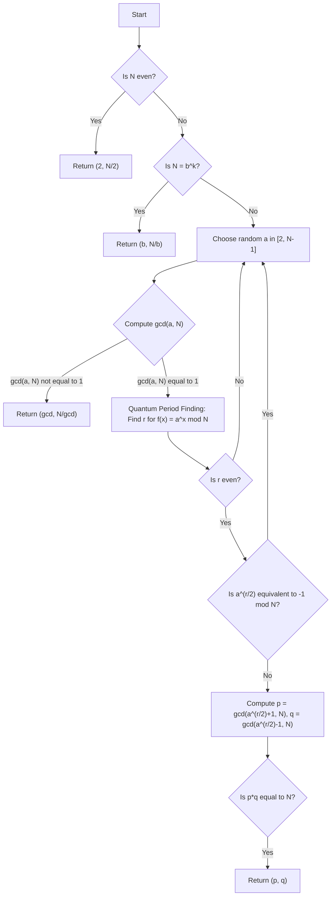

```mermaid
flowchart TD
    Start --> A{"Is N even?"}
    A -- Yes --> B["Return (2, N/2)"]
    A -- No --> C{"Is N = b^k?"}
    C -- Yes --> D["Return (b, N/b)"]
    C -- No --> E["Choose random a in [2, N-1]"]
    E --> F{"Compute gcd(a, N)"}
    F -- "gcd(a, N) not equal to 1" --> G["Return (gcd, N/gcd)"]
    F -- "gcd(a, N) equal to 1" --> H["Quantum Period Finding: Find r for f(x) = a^x mod N"]
    H --> I{"Is r even?"}
    I -- No --> E
    I -- Yes --> J{"Is a^(r/2) equivalent to -1 mod N?"}
    J -- Yes --> E
    J -- No --> K["Compute p = gcd(a^(r/2)+1, N), q = gcd(a^(r/2)-1, N)"]
    K --> L{"Is p*q equal to N?"}
    L -- Yes --> M["Return (p, q)"]
```